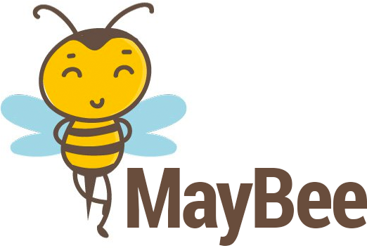

# MayBee



>  Safe chaining of object properties and functions using ES2016 Proxy.


&nbsp;

&nbsp;


* **npm:** `npm install maybee --save`

---

## Getting Started

```javascript
import {safeguard, isUndefined, isNull} from 'maybee';

const person = safeguard({ name: 'Adam', age: null });

console.log(person.name); // Adam
console.log(isNull(person.age)) // true
console.log(isUndefined(person.getNames().firstName)) // true
```
