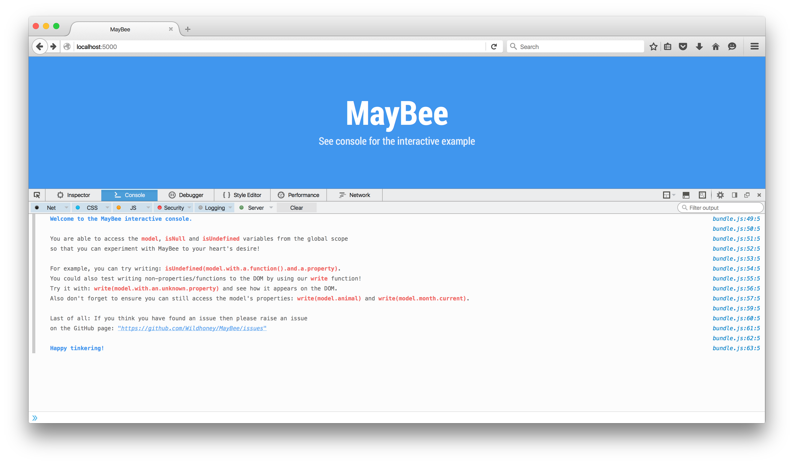

# MayBee


>  Safe chaining of object properties and functions using ES2015 Proxy.


&nbsp;

&nbsp;


* **npm:** `npm install maybee --save`

---

## Getting Started

**Note:** Requires [Proxy support](https://kangax.github.io/compat-table/es6/#test-Proxy).

```javascript
import {safeguard, isUndefined, isNull} from 'maybee';

const person = safeguard({ name: 'Adam', age: null });

console.log(person.name); // Adam
console.log(isNull(person.age)) // true
console.log(isUndefined(person.getNames().firstName)) // true
console.log(isUndefined(person.with.a.long.non.existent.property)) // true
```

See [unit tests](https://github.com/Wildhoney/MayBee/blob/master/test/may-bee.test.js) for further examples &mdash; however considering a primitive isn't returned, then you can continue chaining as required &mdash; this is in anticipation of an eventual value, and therefore primitives are returned when they exist.

## Undefined!

Once `MayBee` finds a primitive value in your object, then all of the `Proxy` witchery is stopped from there on in.

For example, given the `person` above, we can extend infinitely on `undefined` properties and/or functions, but as soon as a primitive or object is available, then normal JavaScript rules are restored:

```javascript
// √
console.log(person.with.an.unknown().property.and.a().function.or.two);

// TypeError: person.name.on is undefined √
console.log(person.name.on.a.known().property);
```

This behaviour makes it easier to stick closely with the JavaScript spec &mdash; otherwise `MayBee` would have to introduce a non-standard function for when you wanted the *value* rather than another `Proxy` &mdash; such as `getValue()` &mdash; ugh!

It also abides by `MayBee`'s philosophy that `MayBee` is used to safely print values of an expected structure, prior to the expected structure being available.

## Example

Try out the [interactive console example on Heroku](http://maybee-app.herokuapp.com/)!



[](http://forthebadge.com)
